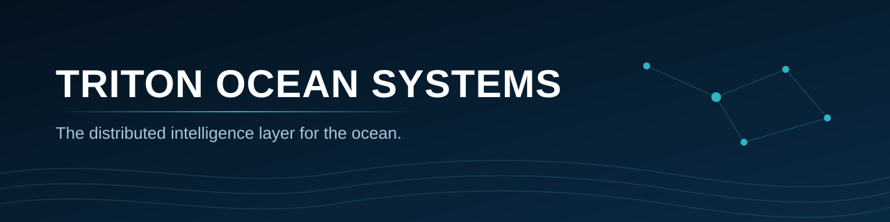

  

  <b>Persistent, low-cost ocean observation. One network. One operating picture.</b>

---

## About us

The ocean is severely under-observed. Sensing is expensive, sensors are isolated, and the data that does get collected is fragmented across incompatible systems and dashboards.

**Triton Ocean Systems** is building the infrastructure to change that: standardized, modular sensing nodes deployed along coastlines, on vessels and offshore, connected to a single software platform that turns raw telemetry into operational intelligence.

We are an early-stage company based in South Florida, starting with coastal deployments along Florida's Gulf and Atlantic coasts.

## What we're building

| | |
|---|---|
| **Triton SEAVANT** | Ocean-intelligence operator console. A single geospatial operating picture across Triton nodes and external feeds: nodes, vessel traffic, environmental conditions, alerts and history. |
| **Triton Nodes** | A modular hardware family built on commercial sensors and compute. **BeachNode** for coastlines, marinas and ports. **OceanNode** for offshore stations. **SailNode** to turn vessels into mobile observation platforms. **Ocean Node 001**, our first reference prototype, is in active development. |
| **Edge + Comms** | On-node inference, event-driven sensing and smart transmission over cellular, LoRa, mesh and satellite, so only what matters leaves the node. |
| **Triton Coastal** | Our first application: coastal intelligence for Florida communities, starting with sargassum monitoring and response planning. |

## Principles

- **Persistent, not periodic.** Continuous observation catches change early.
- **Edge first.** Process locally, transmit what matters.
- **Open interfaces.** Common schemas and APIs so data isn't trapped.
- **Trustworthy data.** Node identity, timestamps, geolocation, calibration metadata and lineage on every observation.
- **Modular by design.** Sensors, radios and compute are independently replaceable.

## Repositories

Our core platform, hardware and autonomy repositories (SEAVANT, Ocean Node 001 and its autonomy stack) are private while in active development. Access for partners and investors is available on request. Public specifications and open data interfaces will appear here as they are released.

## Contact

Partnerships, pilots and investor inquiries: **tritonminingco@gmail.com**

  
  

© Triton Ocean Systems. All rights reserved.
